# Projeto_Ciclistas

### Organiza os dados de um pelotão em uma tabela e gera estatísticas com base nos dados.

 Aplicação desenvolvida para facilitar o monitoramento de um pelotão de ciclistas baseado em um percurso realizado (distância e tempo) e algumas informações pessoais (nome, idade e peso). Calcula o gasto energético de cada ciclista, as respectivas velocidades médias e mostra todos os dados em uma tabela. É possível realizar o ordenamento da tabela de acordo com o parâmetro escolhido além de serem exibidas em uma segunda aba, as estatísticas referentes ao pelotão. Também é possível salvar esses dados em um arquivo do tipo .csv, bem como carregar dados salvos anteriormente.

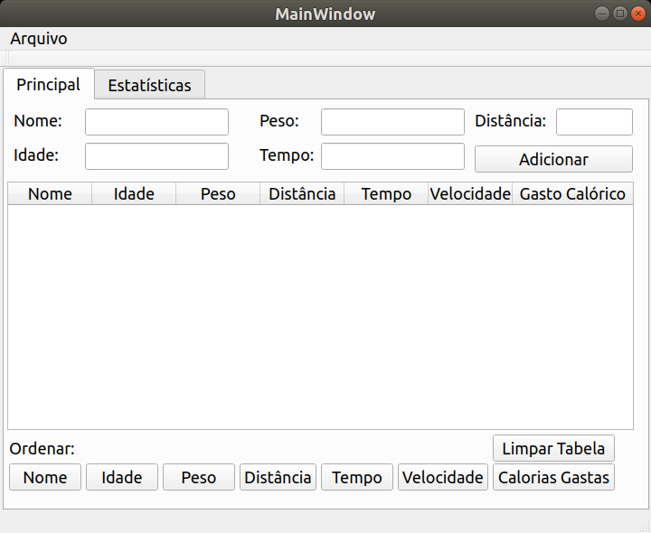

# Manual do Usuário

### Cadastro:

 O programa possui um interface intuitiva, alguns botôes, alguns campos de texto e uma tabela para exibição dos dados.

O formulário deve ser preenchido de acordo com o parâmetro especificado e ao final, clicar no botão "Adicionar" para fazer o cadastro do ciclista. Os dados do ciclista cadastrado serão exibidos na tabela e as estatísticas calculadas automaticamente. A cada novo cadastro, as estatísticas são recalculadas e o novo ciclista é adicionado na tabela.<b> Por padrão, os ciclistas são ordenados por velocidade média sempre que acontece um novo cadastro.</b>

 Caso o mesmo ciclista tente ser cadastrado duas vezes, o programa apagará todos os campos de texto e não cadastrará o ciclista, o mesmo acontece para campos em branco.

<b>Ou seja, é obrigatorio o preenchimento de todos os campos para realização do cadastro.</b>

### Ordenamento

Os dados podem ser ordenados de sete maneiras diferentes. 

<b>1. Nome:</b> Ordena os cicistas de acordo com o nome por ordem alfabética. Não há diferença entre letras  maiúsculas e minúsculas no ordenamento.

<b>2. Idade:</b> Ordena os cicistas de acordo com a idade por ordem crescente.

<b>3. Peso:</b> Ordena os cicistas de acordo com o peso por ordem decrescente.

<b>4. Dsitância:</b> Ordena os cicistas de acordo com a distância por ordem decrescente.

<b>5. Tempo:</b> Ordena os cicistas de acordo com o tempo por ordem crescente.

<b>6. Velocidade média:</b> Ordena os cicistas de acordo com a velocidade média por ordem decrescente.

<b>7. Gasto energético:</b> Ordena os cicistas de acordo com o gasto energético por ordem decrescente.

### Limpando a Tabela

O programa possuí um botão no canro inferior direito que tem a função de limpar a tabela. Será apresentada uma caixa de diálogo confirmando a remoção dos dados da tabela. Após a limpeza, todos os dados não salvos serão perdidos.

### Salvar e Carregar

No canto superior direito o programa possui um menu "Arquivo" que ao ser selecionado apresenta duas opções. Depois de escolhida a opção será aberta uma janela para o usuário indicar o endereço do arquivo a ser salvo ou carregado.

<b>Salvar:</b> O usuário deve escolher o local para salvar o arquivo, colocar um nome e selecionar "Salvar".

<b>Carregar:</b> O usuário deve procurar o arquivo .csv e selecionar "Abrir" para carregar os dados salvos para o programa.

<b>Observação: </b>Não é possível unir os ciclistas cadastrados com algum arquivo carregado. Os dados existentes na tabela serão perdidos quando realizado o carregamento de um arquivo.

### Editar dados da Tabela

Para editar os dados da tabela o usuário deve dar dois cliques na célula que deseja alterar a informação. Uma caixa de dialógo será aberta para confirmar a edição, mediante resposta positiva, outra caixa de diálogo solicitará o novo valor. Feito o procedimento de edição, a tabela e as estatísticas são atualizadas automaticamente.

### Estatísticas

Na segunda aba são exibidas em três grupos as estatísticas calculadas com base nos dados.

<b>1. Desvio Padrão:</b> Calculo do desvio padrão das distâncias, dos tempos e das velocidades médias.

<b>2. Média:</b> Calculo da média das distâncias, dos tempos e das velocidades médias.

<b>3. Destaques:</b> Mostra o ciclista que obteve a maior distância percorrida, o menor tempo gasto para realizar o percurso e a maior velocidade média, respectivamente.

A imagem abaixo mostra a aba "estatísticas" no formato padrão.

# Exemplo

O exemplo abaixo ilustra uma forma de uso do programa.

### Realizando o Cadastro

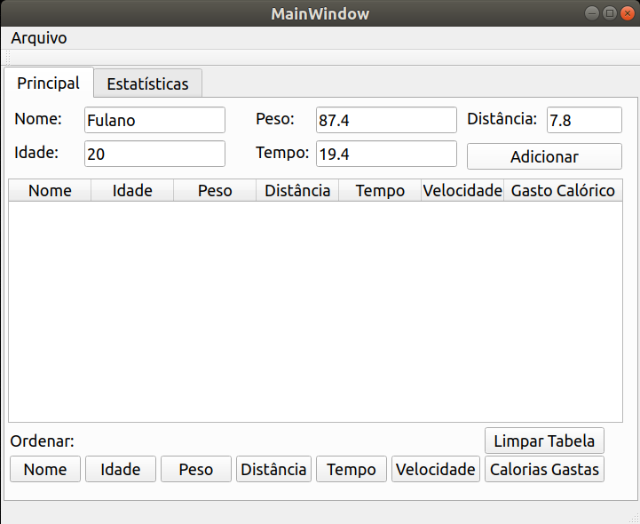 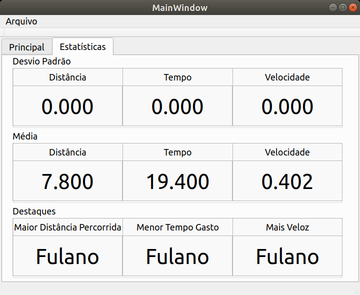

Na primeira imagem colocamos os dados do ciclista. Na segunda imagem o programa os exibiu na tabela. E na terceira imagem estão apresentadas as estatísticas.

### Fazendo ordenamento

Para fazer o ordenamento foi adicionado dois ciclistas.

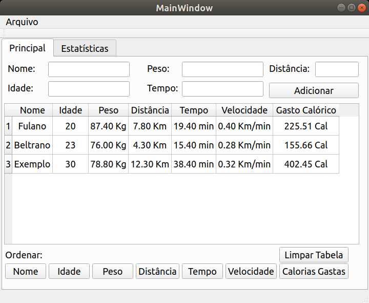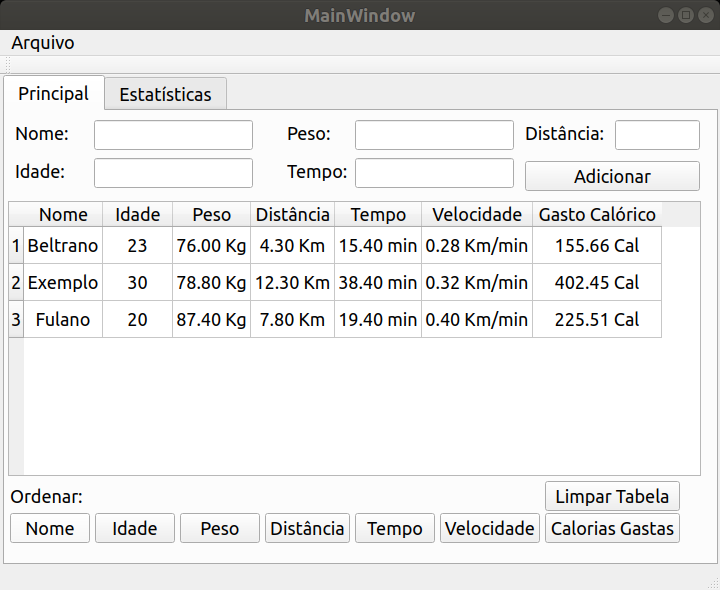 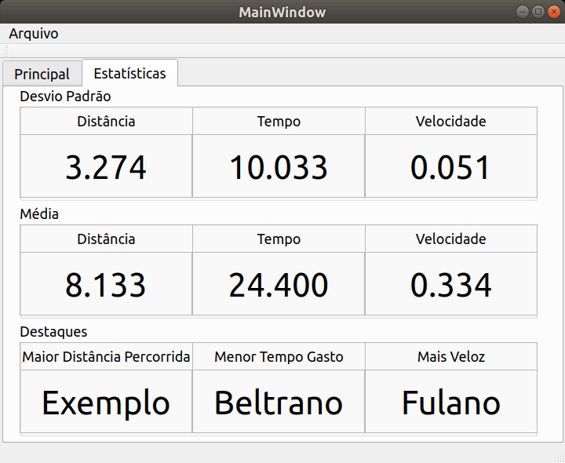

Os ciclistas foram ordenados por nome. Com o cadastro de mais dois ciclistas as estatísticas mudaram, por exemplo, já está sendo calculado o desvio padrão.

### Editando dado da Tabela

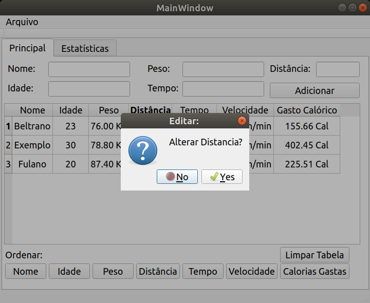 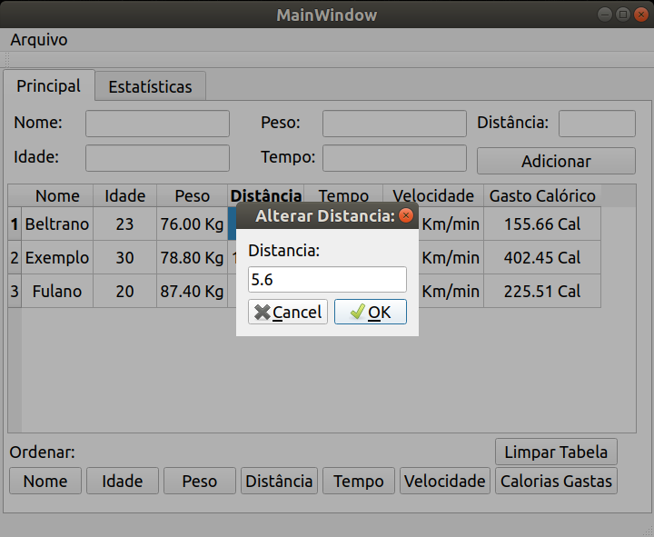

O programa abre as caixas de diálogo das imagens após duplo clique em uma célula. O ciclista "Beltrano" teve sua "Distância" alterada para 5.6 Km. Tudo realizado após confirmação e a sua velocidade média foi alterada. A tabela volta a ser exibida com os novos valores e os ciclistas <b>ordenados por velocidade média</b>.As estatísticas são recalculadas (ver imagem abaixo).

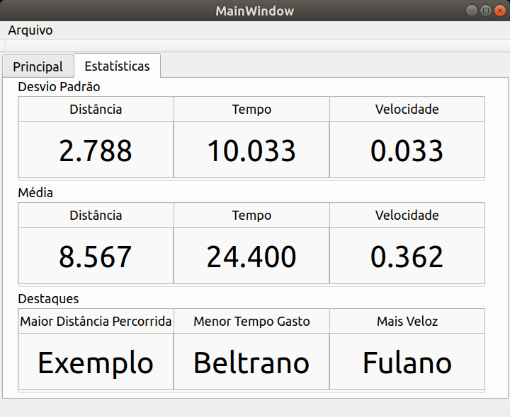

A imagem da esquerda mostra os valores da tabelas antes da alteração da velocidade de "Beltrano", a da direita mostra após alteração

### Salvando os Dados

Para salvar os dados é necessário clicar no menu "Arquivo" no canto superior esquerdo da tela e selecionar "Salvar". Em seguida será apresentado um menu do explorador de arquivos para o usuário escolher onde deverá ser salvo o arquivo ".csv" e também nomear o arquivo para habilitar o botão "Save" no caso da imagem. 

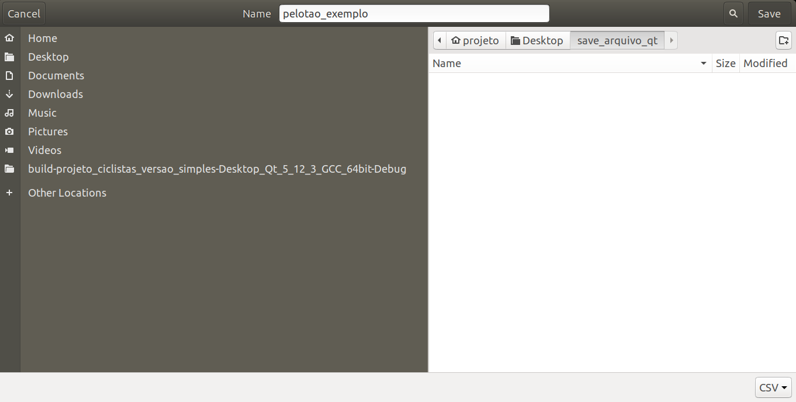 

Foi salvo um arquivo ".csv" nomeado "pelotao_exemplo"

### Limpando a tabela

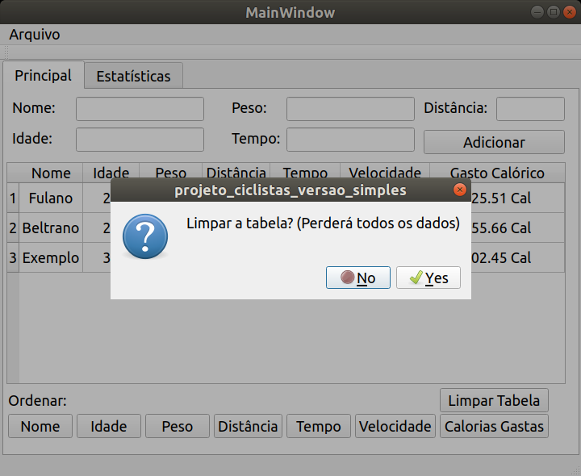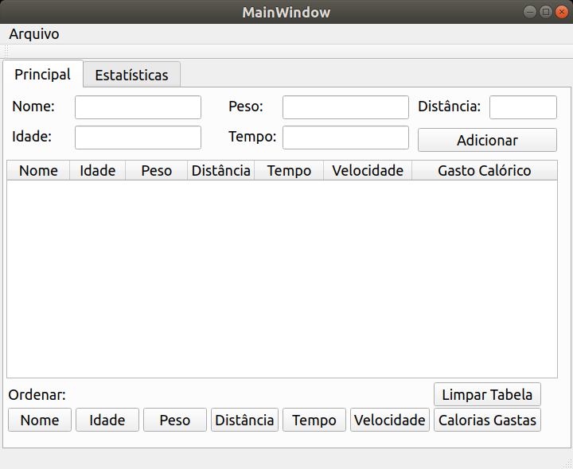 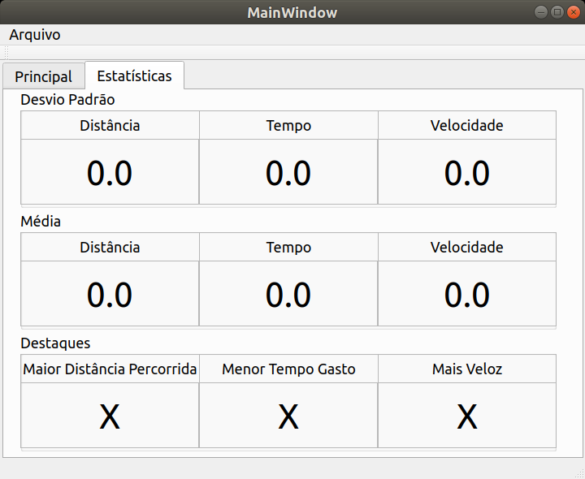

Na primeira imagem, após o clique no botão "Limpar Tabela" verifica-se uma caixa de diálogo com aviso e pedindo confirmação. As outras duas imagens mostram a tabela sem dados e a aba estatísticas em seu formato padrão.

### Carregando os Dados

Para carregar os dados é necesssário acessar o menu "Arquivo" e selecionar "Carregar". Novamente um explorador será aberto, o usuário deve procurar seu arquivo ('pelotao_exemplo' na imagem), selecioná-lo e clicar em "Open" (na imagem) ou "Abrir" (em português). Após isso, a tabela carregada é mostrada e os valores automaticamente <b>ordenados por velocidade média</b> e as estatísticas atualizadas conforme os dados.

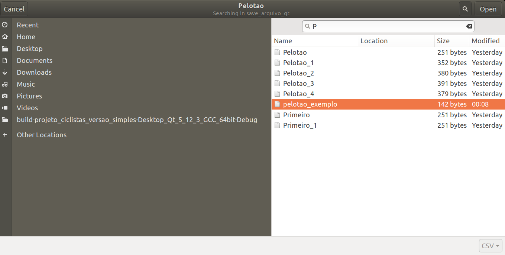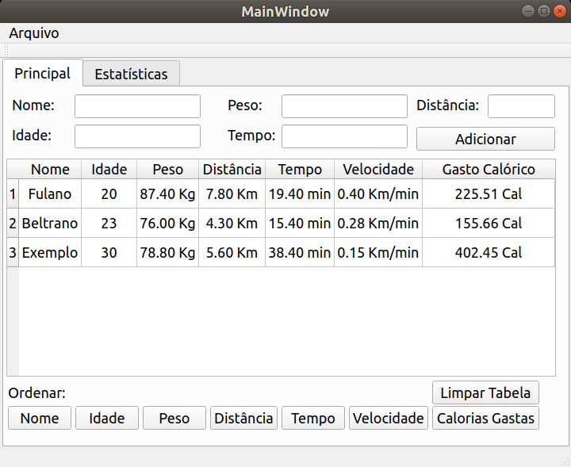 

# Considerações

Este projeto também pode ser utilizado por um único ciclista para registrar seus percursos e obter suas estatísticas. Por exemplo, poderia nomear o ciclista de "Dia_Um" e anotar o restante dos dados, fazendo o mesmo para os próximos dias, dessa maneira terá um panorâma de suas pedalas.

É um programa que pode ser usado tanto coletivamente quanto individualmente.

